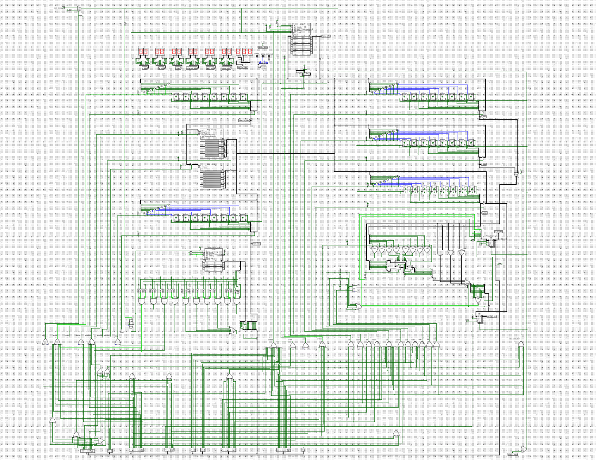
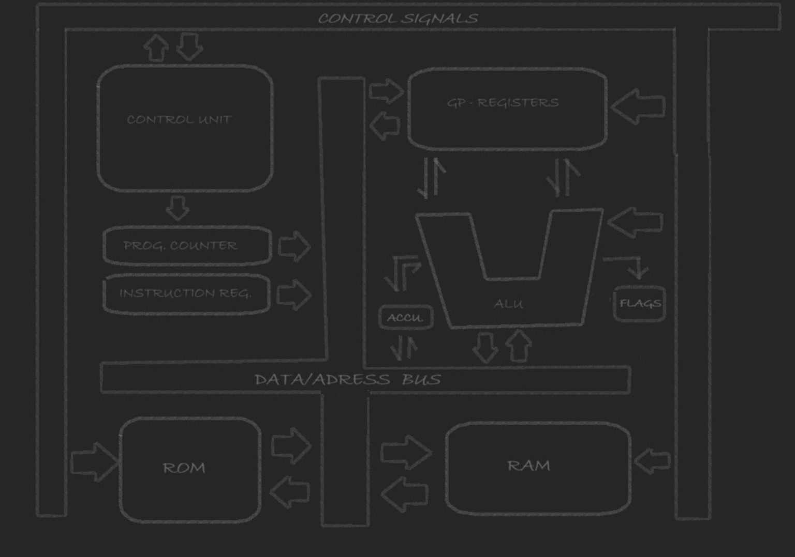

# Custom 8-bit Processor

A custom 8-bit CPU designed and built in Logisim from basic digital logic blocks.

This project was made to understand how a processor works from the hardware level up: registers, an ALU, a shared bus, memory, instruction decoding, control signals, and instruction sequencing.

The CPU has its own instruction set and its own assembly language. Programs are loaded into a 256-byte RAM and executed one instruction at a time.

## What is in the CPU?

- 8-bit datapath and shared data/address bus
- A, B and C registers
- A register used as the accumulator
- Arithmetic and logical ALU operations
- Carry, Zero and Positive status indicators
- Program Counter (PC)
- Memory Address Register (MAR)
- Instruction Register (IR)
- Instruction decoder
- Control logic and microcode counter
- 256-byte RAM used for program execution
- ROM present in the hardware design
- Output register and display
- Register/state monitoring displays

## A quick look at the architecture

The processor uses a single common bus for both addresses and data. Only one source is allowed to drive the bus at a time.

A simplified view is:

```text
                    +----------------+
                    |  Control Unit  |
                    | + Microcode    |
                    |   Counter      |
                    +--------+-------+
                             |
                  control signals
                             |
       +---------+           v           +---------+
       |   PC    | ------>  BUS  <-----> |   RAM   |
       +---------+           ^            +---------+
            |                |                 |
            v                |                 |
       +---------+            |            +----+----+
       |   MAR   | <----------+            |   IR    |
       +---------+                         +---------+
                                             |
                                             v
                                      +--------------+
                                      |   Decoder    |
                                      +--------------+
                                             |
                         +-------------------+-------------------+
                         |                   |                   |
                         v                   v                   v
                      +------+           +------+            +------+
                      |  A   |           |  B   |            |  C   |
                      | Acc. |           | GPR  |            | GPR  |
                      +--+---+           +------+            +------+
                         |
                         v
                      +------+
                      |  ALU |
                      +--+---+
                         |
                  +------+------+
                  |             |
                  v             v
               FLAGS      OUTPUT REG
```

## Instruction timing

Every instruction takes 9 clock cycles in the current implementation.

The first three cycles are common to the instruction fetch:

| Cycle | Operation | Purpose |
|---|---|---|
| C1 | `PC OUT -> MAR IN` | Put the PC address into the Memory Address Register |
| C2 | `WAIT` | Empty cycle needed for the Logisim RAM to respond to a newly selected address |
| C3 | `RAM OUT -> IR IN` | Load the fetched instruction into the Instruction Register |
| C4-C9 | Instruction-specific | Execute the current instruction |

The PC is held during the instruction sequence and is updated according to the control logic after the instruction cycle is completed. For memory-addressed instructions such as `LDA`, `STA` and `JMP`, the address is handled through the MAR while the RAM access is performed.

## Instruction set

The current ISA contains data-transfer, arithmetic, logical, memory, branch, I/O and halt instructions.

See [docs/INSTRUCTION_SET.md](docs/INSTRUCTION_SET.md) for the complete opcode table.

## Example program

The repository includes a Fibonacci example. It uses the carry flag to stop before an 8-bit overflow would be displayed:

```asm
MVI A,00H
MOV B,A
MVI A,01H
MOV C,A

LOOP:
    MOV A,B
    ADD C
    JC END
    MOV B,C
    MOV C,A
    OUT
    JMP LOOP

END:
    HLT
```

The program produces:

```text
1
2
3
5
8
13
21
34
55
89
144
233
```

The next mathematical Fibonacci value is 377, which does not fit in 8 bits. The addition wraps around to `79H` (`121`) with the Carry flag set, so `JC END` stops the processor before that overflowed value reaches the output.

## Hardware

Here is the complete processor schematic as it currently exists in Logisim:



And this is the high-level architecture sketch used while organizing the design:



The repository also contains screenshots of the individual subsystems:

- Complete CPU schematic
- Control unit / instruction decoder
- ALU and flag logic
- A, B and C registers
- Program counter and memory system
- Output and status displays
- Logical-operation decoder
- High-level architecture diagram
- Original opcode reference sheet

See [hardware/](hardware/) for the images and [docs/ARCHITECTURE.md](docs/ARCHITECTURE.md) for the written architecture description.

## Project status

This repository documents the current working version of the processor as implemented in Logisim. The documentation is based on the hardware and instruction set used in the project.

## Logisim version 

This processor works on the logisim version v2.13.8 and it is included in the files.

## Next things that could be added

- More assembly example programs
- A formal micro-operation table for all instructions
- An assembler for the custom ISA
- A cleaner block-level architecture diagram
- Automated test programs for arithmetic, branching and memory instructions
